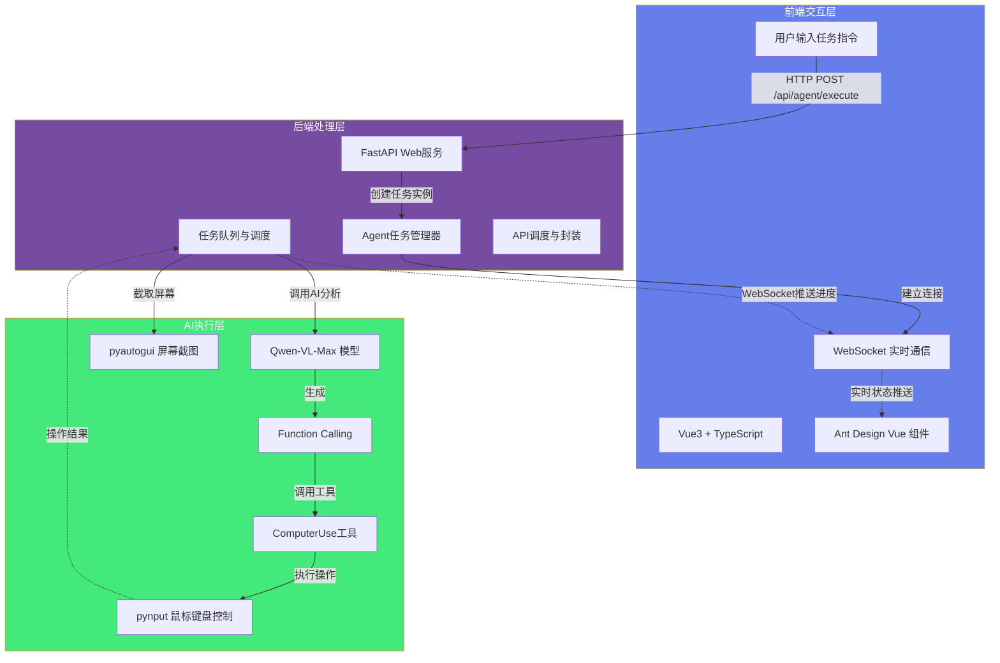
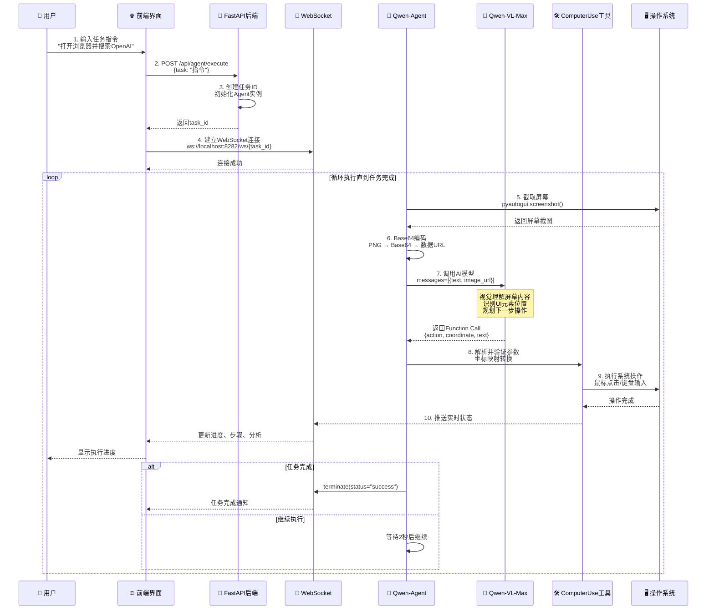
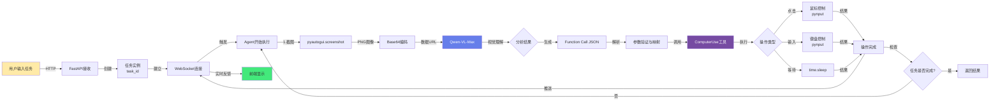
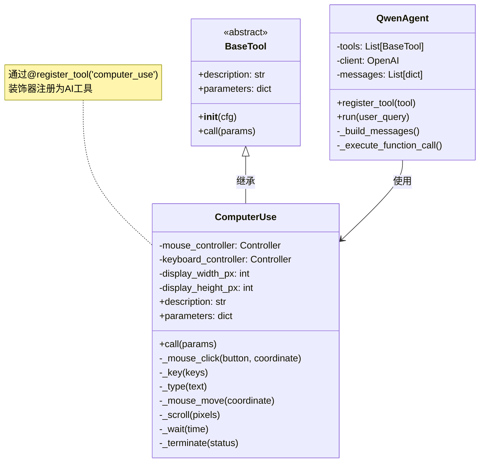
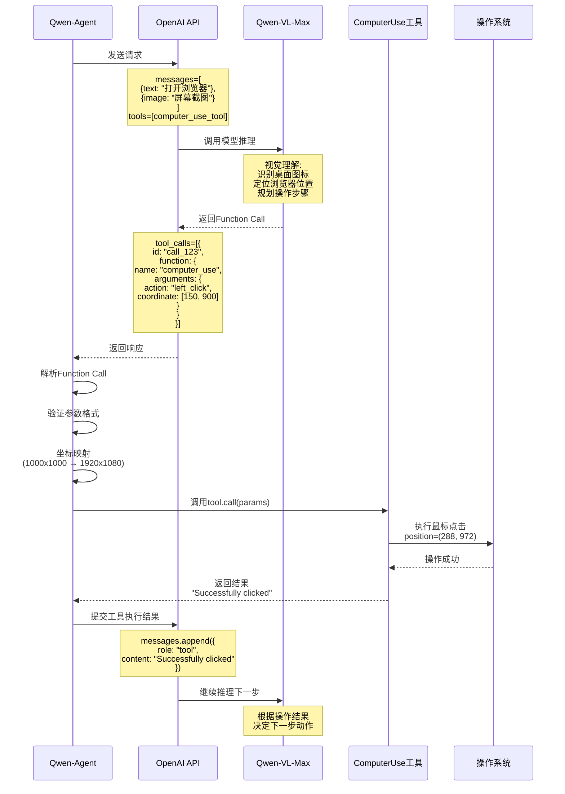
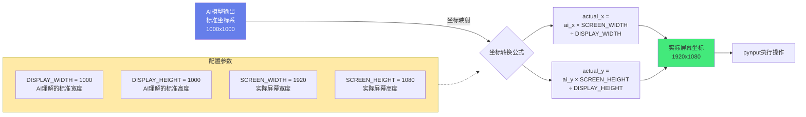
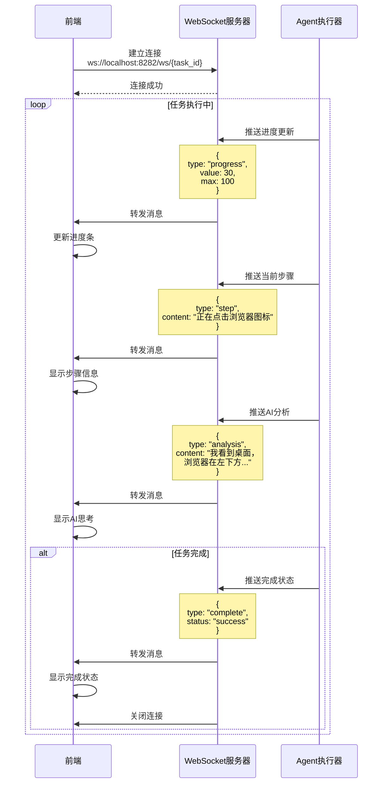
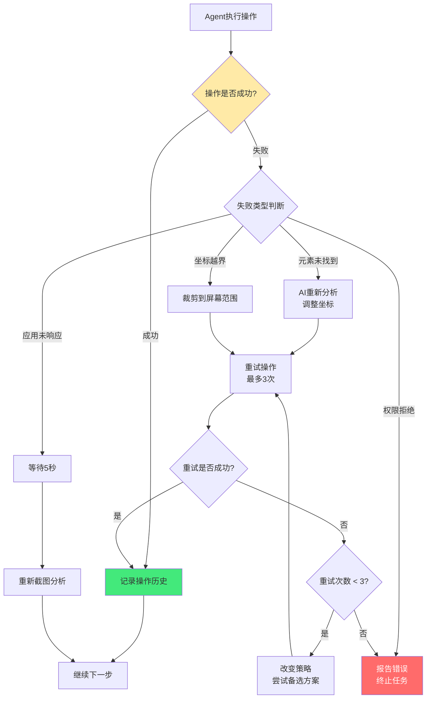
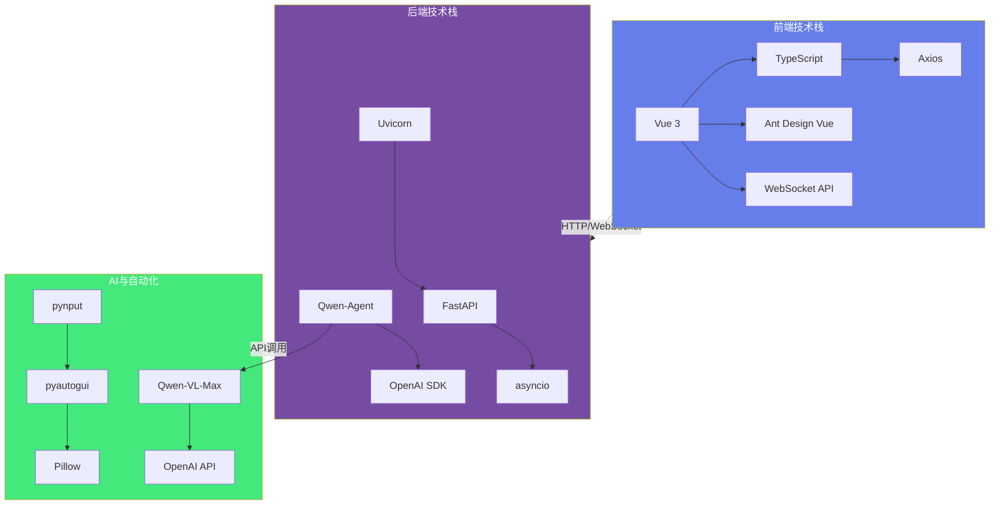
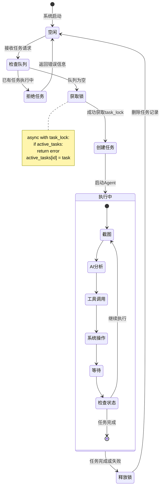

# AI自动化助手技术架构 - Mermaid图表

## 1. 整体系统架构（三层架构）

## 2. 完整工作流程（10步详细流程）

## 3. 数据流向图

## 4. Qwen-Agent工具注册机制

## 5. Function Calling 流程

## 6. 坐标映射机制

## 7. WebSocket实时通信

## 8. 错误处理与恢复机制

## 9. 技术栈依赖关系

## 10. 并发控制机制

---

## 使用说明

这些Mermaid图表可以直接在支持Mermaid的Markdown编辑器中渲染，例如：
- GitHub/GitLab
- Typora
- VSCode (安装Mermaid插件)
- Obsidian
- 在线工具：https://mermaid.live/

复制对应的代码块到你的Markdown文件中即可显示图表。

