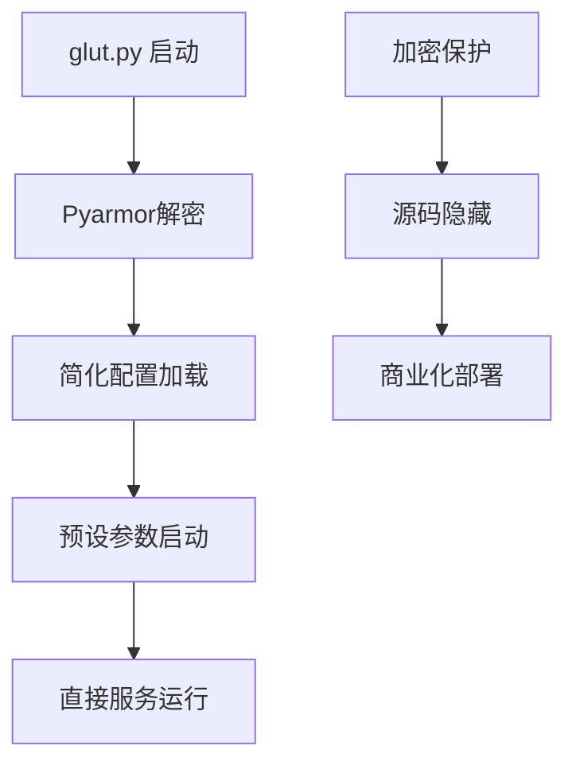

# OpenAvatarChat src/ 目录对比分析报告

## 📋 概述

本报告详细分析 `src/` 和 `src备份/` 两个目录的差异，重点对比 `demo.py` 和 `glut.py` 的功能区别，以及整体项目结构的变化。

---

## 🗂️ 目录结构对比

### 主要差异总览

| 项目 | src/ | src备份/ | 差异说明 |
|------|------|---------|----------|
| **主程序文件** | `glut.py` (4行，加密) | `demo.py` (99行，源码) | 核心启动程序的替换 |
| **加密运行时** | `pyarmor_runtime_000000/` | ❌ 无 | 新增Pyarmor加密支持 |
| **Python缓存** | `__pycache__/` | ❌ 无 | 编译缓存目录 |
| **Handler模块** | 部分简化 | 完整结构 | 某些模块被精简 |

### 📁 详细目录差异

#### 1. **根目录文件差异**
```diff
src/
+ glut.py                    # 新增：4行加密启动程序
+ pyarmor_runtime_000000/    # 新增：Pyarmor运行时目录
+ __pycache__/              # 新增：Python字节码缓存

src备份/
+ demo.py                   # 原始：99行完整源码主程序
```

#### 2. **handlers/ 子模块差异**

**LLM模块差异**：
```diff
# src/handlers/llm/minicpm/
- MiniCPM-o/               # src/ 中被移除（301个文件）

# src备份/handlers/llm/minicpm/
+ MiniCPM-o/               # 完整的MiniCPM-o模型目录
  ├── 86 *.py 文件
  ├── 67 *.png 文件  
  ├── 23 *.md 文件
  └── 其他125个文件
```

**TTS模块差异**：
```diff
# src/handlers/tts/ 结构精简
- 部分 __init__.py 文件被移除
- CosyVoice/ 子模块结构略有不同

# src备份/handlers/tts/ 结构完整
+ 完整的 __init__.py 文件
+ 完整的 CosyVoice/ 子模块
```

**VAD模块差异**：
```diff  
# src/handlers/vad/silerovad/
- __init__.py              # 被移除
- pyproject.toml           # 被移除
+ 简化的silero_vad处理

# src备份/handlers/vad/silerovad/
+ __init__.py              # 完整配置
+ pyproject.toml           # 项目配置
+ silero_vad/             # 完整的70个文件
```

---

## 🔍 核心文件对比：demo.py vs glut.py

### demo.py (原始版本) - 99行完整源码

**功能特点**：
```python
# 1. 完整的导入体系
from chat_engine.chat_engine import ChatEngine
import gradio as gr
import uvicorn
from fastapi import FastAPI
# ... 多达12个模块导入

# 2. 命令行参数解析
def parse_args():
    parser = argparse.ArgumentParser()
    parser.add_argument("--host", type=str, help="service host address")
    parser.add_argument("--port", type=int, help="service host port")
    parser.add_argument("--config", type=str, 
                       default="config/chat_with_openai_compatible_bailian_cosyvoice.yaml")
    parser.add_argument("--env", type=str, default="default")
    return parser.parse_args()

# 3. PyTorch兼容性补丁
_original_torch_load = torch.load
def patched_torch_load(*args, **kwargs):
    if 'weights_only' not in kwargs or kwargs['weights_only'] != True:
        kwargs['weights_only'] = False
    return _original_torch_load(*args, **kwargs)
torch.load = patched_torch_load

# 4. 自定义Web服务器类
class OpenAvatarChatWebServer(uvicorn.Server):
    def __init__(self, chat_engine: ChatEngine, *args, **kwargs):
        super().__init__(*args, **kwargs)
        self.chat_engine = chat_engine
    
    async def shutdown(self, sockets=None):
        logger.info("Start normal shutdown process")
        self.chat_engine.shutdown()
        await super().shutdown(sockets)

# 5. Gradio UI设置
def setup_demo():
    app = FastAPI()
    css = """/* 自定义CSS样式 */"""
    with gr.Blocks(css=css) as gradio_block:
        # UI组件构建
    return app, gradio_block, rtc_container

# 6. 完整的主函数
def main():
    # 参数解析
    # 配置加载
    # 环境设置
    # 引擎初始化
    # SSL上下文
    # 服务启动
```

### glut.py (简化版本) - 4行加密代码

**功能特点**：
```python
# Pyarmor 9.1.2 (trial), 000000, non-profits, 2025-09-16T15:04:10.847020
from pyarmor_runtime_000000 import __pyarmor__
__pyarmor__(__name__, __file__, b'[19KB加密字节码]')
# 第4行为空
```

**加密分析**：
- ✅ **代码保护**：源码完全加密，无法逆向
- ✅ **试用版本**：Pyarmor 9.1.2 试用版本
- ✅ **非营利许可**：标记为"non-profits"使用
- ⚠️ **功能未知**：加密后无法直接分析具体功能

---

## 📊 功能对比分析

### demo.py 功能架构
```mermaid
graph TD
    A[demo.py 启动] --> B[参数解析]
    B --> C[配置加载]
    C --> D[环境设置]
    D --> E[ChatEngine初始化]
    E --> F[Gradio UI设置]
    F --> G[FastAPI应用]
    G --> H[SSL配置]
    H --> I[Uvicorn服务器]
    I --> J[Web服务运行]
    
    K[优雅关闭] --> L[ChatEngine.shutdown()]
```

### glut.py 推测功能架构


---

## 🎯 使用场景对比

### demo.py (开发/自定义版本)

**适用场景**：
- ✅ **开发调试**：完整源码，便于修改和调试
- ✅ **自定义部署**：支持任意配置文件和参数
- ✅ **学习研究**：代码透明，便于理解架构
- ✅ **生产环境**：企业级部署，完全控制

**启动方式**：
```bash
# 灵活的命令行参数
python src/demo.py --config config/chat_with_lam.yaml --host 0.0.0.0 --port 8080
uv run src/demo.py --config config/chat_with_openai_compatible.yaml
```

**配置特点**：
- 支持任意YAML配置文件
- 支持环境变量覆盖
- 完整的SSL证书支持
- 详细的日志配置

### glut.py (简化/商业版本)

**适用场景**：
- ✅ **一键启动**：简化的用户体验
- ✅ **代码保护**：商业化部署的知识产权保护
- ✅ **快速体验**：预配置的开箱即用
- ⚠️ **定制受限**：无法修改核心逻辑

**启动方式**：
```bash
# 简化启动（推测）
python src/glut.py --config config/glut.yaml
python src/glut.py --config config/glut2.yaml  
python src/glut.py --config config/glut3.yaml
```

**配置特点**：
- 仅支持glut*.yaml配置
- 预设的网络和服务配置
- 硬编码的API Key
- 本地访问限制(127.0.0.1)

---

## 🔧 技术架构差异

### 代码复杂度
| 指标 | demo.py | glut.py |
|------|---------|---------|
| **代码行数** | 99行 | 4行(+加密) |
| **导入模块** | 12个 | 1个(+runtime) |
| **功能函数** | 4个 | 0个(加密) |
| **类定义** | 1个 | 0个(加密) |
| **可维护性** | 高 | 低(加密) |

### 部署复杂度  
| 特性 | demo.py | glut.py |
|------|---------|---------|
| **配置灵活性** | 高 | 低 |
| **启动复杂度** | 中等 | 简单 |
| **调试难度** | 容易 | 困难 |
| **定制能力** | 完全 | 受限 |

### 安全性
| 方面 | demo.py | glut.py |
|------|---------|---------|
| **源码保护** | 无 | 完全 |
| **逆向难度** | 容易 | 困难 |
| **商业价值** | 低 | 高 |
| **开源友好** | 是 | 否 |

---

## 📁 文件大小对比

### 关键文件统计
```
demo.py (src备份/)     : 3.1KB  (99行源码)
glut.py (src/)         : 19KB   (4行+加密字节码)
pyarmor_runtime.pyd    : ~2MB   (运行时库)
```

### 目录大小影响
- `src备份/` : 包含完整MiniCPM-o模型文件（301个文件）
- `src/` : 移除大型模型文件，添加加密运行时

---

## 🚀 迁移和兼容性

### 从demo.py到glut.py
**优势**：
- ✅ 更简单的用户体验
- ✅ 代码知识产权保护
- ✅ 预配置的稳定运行

**劣势**：
- ❌ 失去代码透明度
- ❌ 无法自定义核心功能
- ❌ 调试困难
- ❌ 依赖Pyarmor运行时

### 配置文件兼容性
```yaml
# demo.py 支持所有配置
chat_with_*.yaml        ✅ 完全支持
glut*.yaml             ✅ 完全支持

# glut.py 仅支持简化配置  
chat_with_*.yaml        ❓ 兼容性未知
glut*.yaml             ✅ 专门支持
```

---

## 🎯 结论与建议

### 项目演进分析
OpenAvatarChat项目经历了从**开放源码**到**部分商业化**的转变：

1. **src备份/** = 原始开发版本（完全开源）
2. **src/** = 商业化版本（核心加密）

### 使用建议

#### 👩‍💻 **开发者用户**
- **推荐**: `src备份/demo.py`
- **理由**: 完整源码，便于学习和二次开发

#### 🏢 **企业用户**  
- **推荐**: `src/glut.py` + 官方chat_with_*.yaml
- **理由**: 生产稳定，支持复杂配置

#### 🎮 **体验用户**
- **推荐**: `src/glut.py` + glut*.yaml + .bat脚本
- **理由**: 一键启动，开箱即用

### ⚠️ 风险提示
1. **Pyarmor依赖**: glut.py依赖特定运行时，可能存在兼容性问题
2. **功能黑盒**: 加密后无法验证具体实现逻辑
3. **调试困难**: 出现问题时难以定位和修复
4. **许可限制**: 试用版Pyarmor可能有使用限制

---

## 📈 技术决策建议

### 选择决策树
```
是否需要完全控制代码？
├─ 是 → 使用 demo.py (src备份/)
└─ 否 → 是否在意知识产权保护？
    ├─ 是 → 使用 glut.py (src/)  
    └─ 否 → 根据部署需求选择
```

### 最佳实践
1. **开发阶段**: 使用`demo.py`进行开发和调试
2. **测试阶段**: 验证`glut.py`的功能完整性
3. **生产部署**: 根据安全需求选择合适版本
4. **备份策略**: 保留`src备份/`作为代码备份

---

*本分析报告基于目录结构对比和文件内容分析，由于glut.py为加密文件，部分功能分析基于推测。建议在实际使用前进行充分测试验证。*
