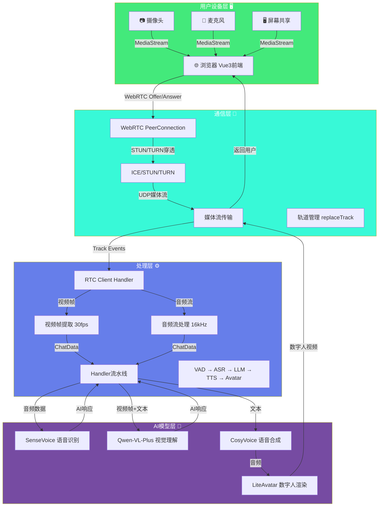
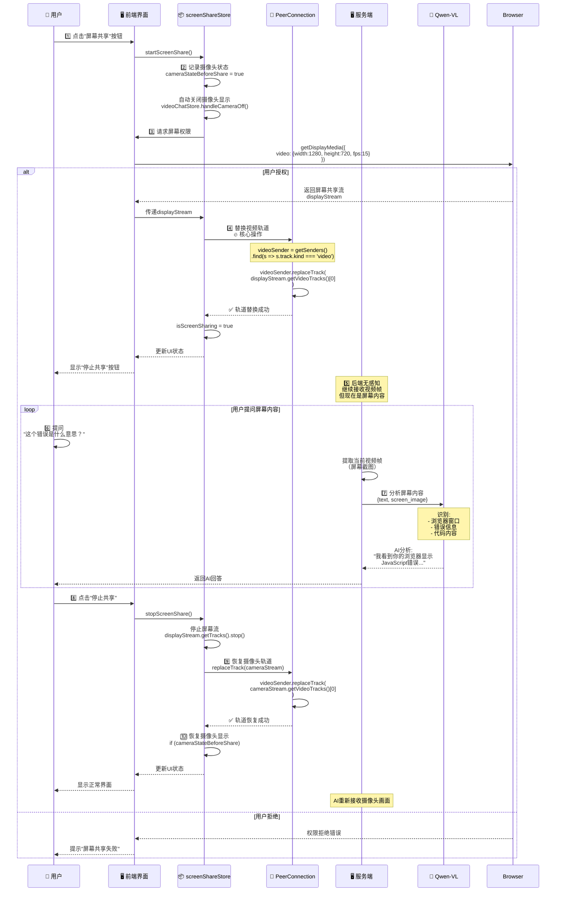
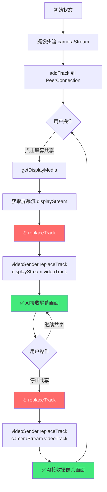
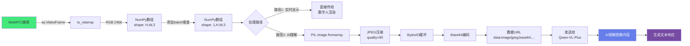
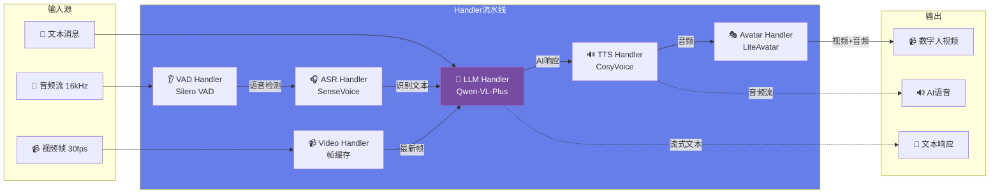
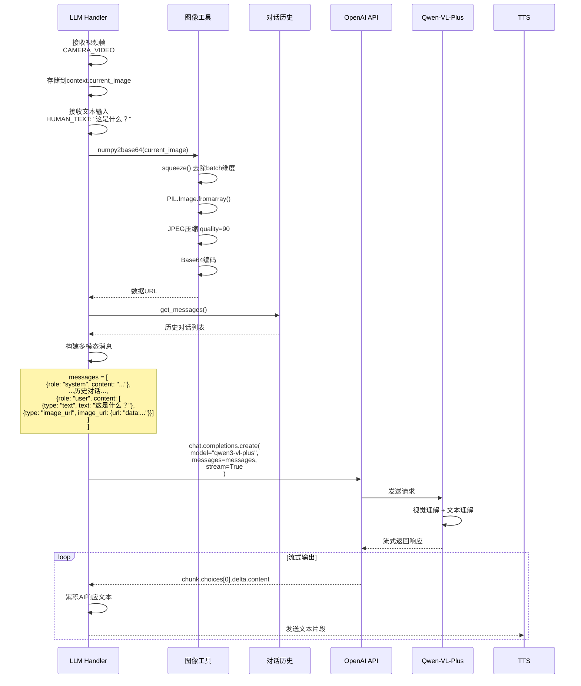
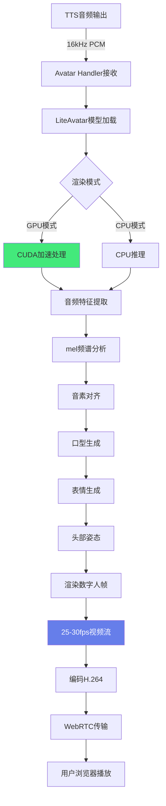
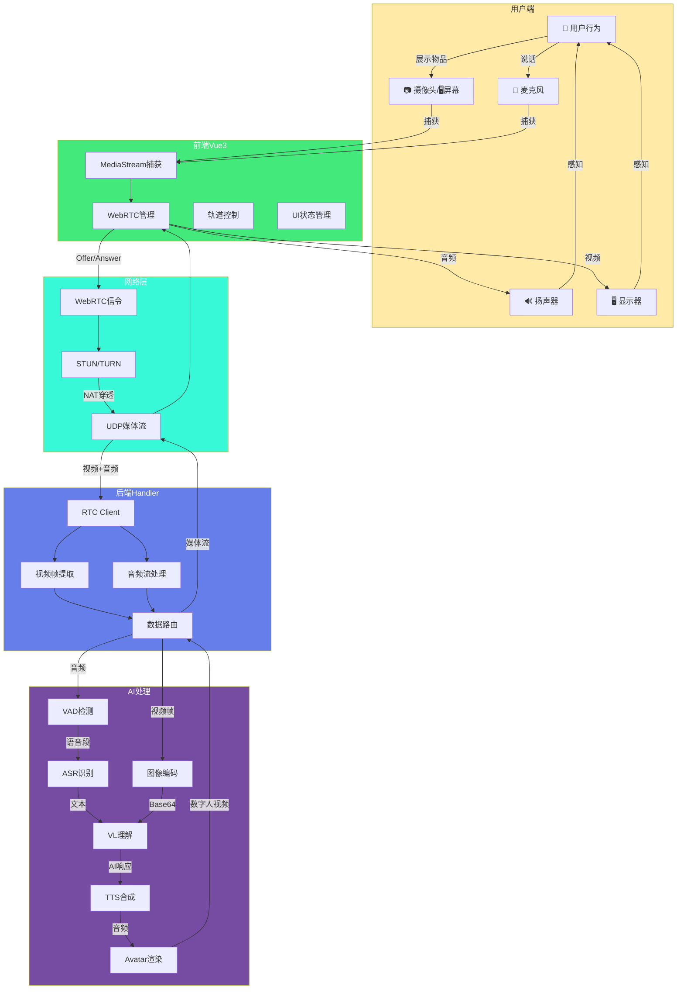
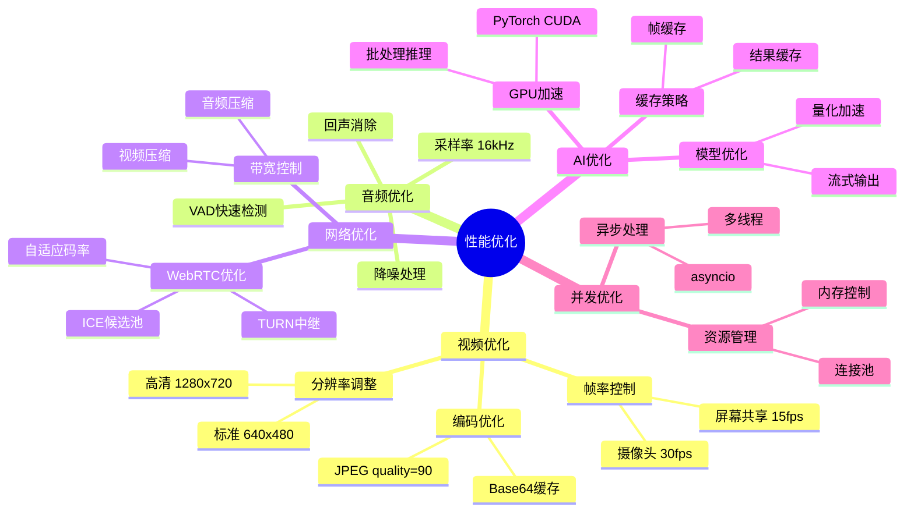
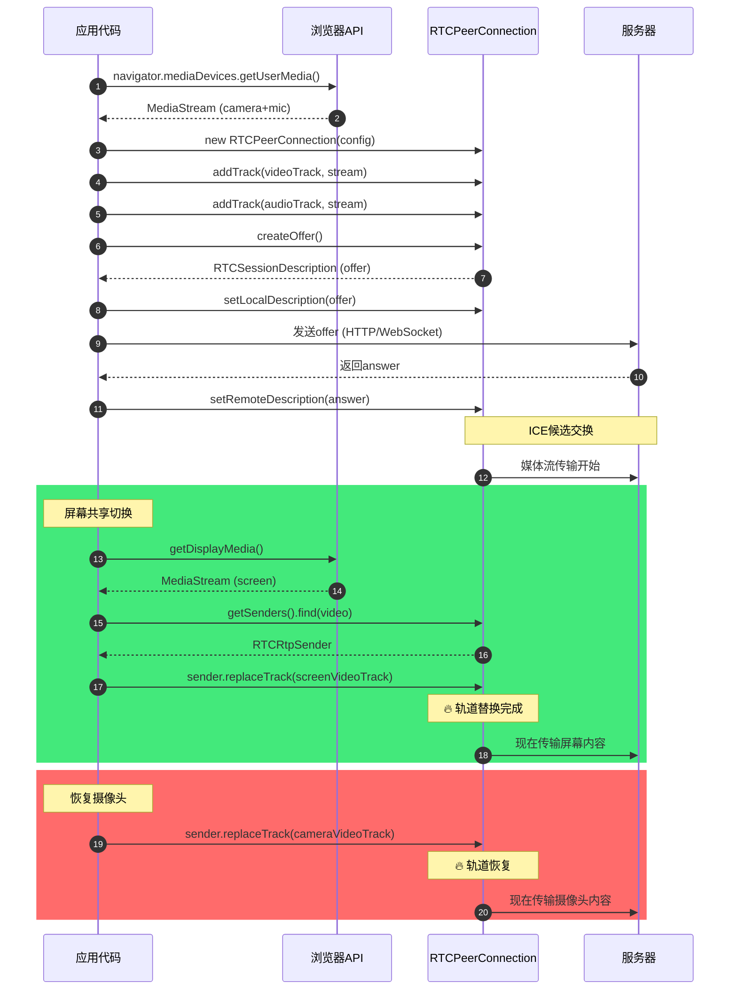

# 数字人交互技术架构 - Mermaid图表

## 1. 整体系统架构（四层架构）



## 2. 摄像头视频对话完整流程

```mermaid
sequenceDiagram
    participant User as 👤 用户
    participant Browser as 🌐 浏览器
    participant WebRTC as 📡 WebRTC
    participant Server as 🖥️ 服务端
    participant VAD as 👂 VAD
    participant ASR as 🎧 ASR
    participant VL as 🧠 Qwen-VL
    participant TTS as 🔊 TTS
    participant Avatar as 🎭 Avatar
    
    User->>Browser: 1️⃣ 开启摄像头和麦克风
    Browser->>Browser: getUserMedia()<br/>video: 640x480@30fps<br/>audio: 16kHz
    
    Browser->>WebRTC: 2️⃣ 建立WebRTC连接
    WebRTC->>WebRTC: createOffer()<br/>ICE候选收集
    WebRTC->>Server: 发送Offer
    Server-->>WebRTC: 返回Answer
    WebRTC->>WebRTC: P2P连接建立
    
    loop 媒体流持续传输
        Browser->>Server: 3️⃣ 视频流 30fps<br/>音频流 16kHz
    end
    
    User->>User: 4️⃣ 开始说话
    Server->>VAD: 音频流输入
    VAD->>VAD: Silero VAD检测<br/>语音活动起始
    
    User->>User: 说话结束
    VAD->>VAD: 检测语音终止
    VAD->>ASR: 5️⃣ 完整音频段
    
    ASR->>ASR: SenseVoice识别
    ASR-->>Server: 文本: "这是什么？"
    
    Server->>Server: 6️⃣ 提取最新视频帧<br/>NumPy (1,480,640,3)
    Server->>Server: JPEG压缩 + Base64编码
    
    Server->>VL: 7️⃣ 多模态推理<br/>messages=[<br/>{text: "这是什么？"},<br/>{image: "data:image/jpeg;base64,..."}]
    
    Note over VL: 视觉理解:<br/>识别物体、场景、文字<br/>结合上下文生成回答
    
    VL-->>Server: AI响应:<br/>"我看到你手里拿着一个红色的苹果..."
    
    Server->>TTS: 8️⃣ 文本转语音
    TTS->>TTS: CosyVoice合成<br/>生成自然语音
    TTS-->>Server: 音频流 16kHz PCM
    
    Server->>Avatar: 9️⃣ 数字人渲染
    Avatar->>Avatar: LiteAvatar驱动<br/>音频→口型+表情
    Avatar-->>Server: 数字人视频 25-30fps
    
    Server->>WebRTC: 🔟 媒体流返回
    WebRTC->>Browser: 数字人视频 + AI语音
    Browser->>User: 播放数字人回答
    
    Note over User: 端到端延迟: ~2.2秒
```

## 3. 屏幕共享实现流程



## 4. WebRTC视频轨道替换机制



## 5. 视频帧处理管道



## 6. Handler流水线架构



## 7. 多模态消息构建



## 8. 数字人渲染流程



## 9. TURN服务器NAT穿透

```mermaid
sequenceDiagram
    participant Client as 客户端浏览器
    participant STUN as STUN服务器
    participant TURN as TURN服务器<br/>8.138.87.249
    participant Server as 服务端
    
    Client->>STUN: 1️⃣ STUN请求<br/>获取公网IP
    STUN-->>Client: 返回公网地址
    
    Client->>Client: 2️⃣ 收集ICE候选
    Note over Client: candidate类型:<br/>- host (本地)<br/>- srflx (STUN反射)<br/>- relay (TURN中继)
    
    Client->>Server: 3️⃣ 发送Offer<br/>包含ICE候选
    
    Server->>Server: 处理Offer
    Server-->>Client: 返回Answer
    
    Client->>Server: 4️⃣ 尝试P2P连接
    
    alt P2P连接成功
        Client<->>Server: 直接UDP通信<br/>低延迟
    else P2P连接失败 (严格NAT)
        Client->>TURN: 5️⃣ 请求TURN中继<br/>username + credential
        TURN-->>Client: 分配中继地址
        
        Client->>TURN: 6️⃣ 发送媒体数据
        TURN->>Server: 转发数据
        
        Server->>TURN: 返回数据
        TURN->>Client: 转发数据
        
        Note over Client,Server: 通过TURN中继通信<br/>稍高延迟但稳定
    end
```

## 10. 完整数据流（端到端）



## 11. 性能优化策略



## 12. 关键API调用时序



---

## 使用说明

这些Mermaid图表可以直接在支持Mermaid的Markdown编辑器中渲染，例如：
- **GitHub/GitLab** - 原生支持
- **Typora** - Markdown编辑器
- **VSCode** - 安装Mermaid Preview插件
- **Obsidian** - 原生支持
- **在线工具** - https://mermaid.live/

### 推荐使用方式

1. **在线预览**：访问 https://mermaid.live/，粘贴代码即可实时预览
2. **VSCode**：安装 "Markdown Preview Mermaid Support" 插件
3. **导出图片**：在mermaid.live中可以导出为PNG/SVG格式

### 图表说明

- **架构图** - 使用 `graph` 展示系统层次结构
- **时序图** - 使用 `sequenceDiagram` 展示交互流程
- **流程图** - 使用 `flowchart` 展示数据处理流程
- **状态图** - 使用 `stateDiagram` 展示状态转换
- **类图** - 使用 `classDiagram` 展示代码结构
- **思维导图** - 使用 `mindmap` 展示优化策略


---
config:
  layout: elk
---
flowchart LR
 subgraph InputCapture["媒体捕获"]
        Camera["📹 摄像头<br><small></small>"]
        Screen["🖥️ 屏幕共享<br><small></small>"]
        Mic["🎤 麦克风<br><small></small>"]
  end
 subgraph Frontend["🖥️ 前端层"]
    direction TB
        InputCapture
        WebRTC["🔗 WebRTC<br>网页实时通信"]
        TURN["🌐 TURN服务器<br><small>NAT穿透</small>"]
  end
 subgraph MediaSplit["媒体分离"]
        VideoSplit["📹 视频分离器"]
        AudioSplit["🎵 音频分离器"]
  end
 subgraph Backend["⚙️ 后端服务层"]
    direction TB
        RtcStream["📡 RTC Stream<br><small>WebRTC流处理</small>"]
        SessionMgr["🔐 会话管理<br><small>并发/隔离</small>"]
        MediaSplit
  end
 subgraph VideoPath["视频路径"]
        CameraFrame["📹 摄像头帧<br><small>视频通话</small>"]
        ScreenFrame["🖥️ 屏幕共享<br><small>实时画面</small>"]
  end
 subgraph AudioPath["音频路径"]
        VAD["👂 VAD<br><small>语音检测</small>"]
        ASR["🎧 ASR<br><small>语音识别</small>"]
  end
 subgraph InputProcess["📥 输入处理层"]
    direction TB
        VideoPath
        AudioPath
  end
 subgraph AICore["🧠 AI处理层"]
    direction TB
        FrameCache["🖼️ 实时画面"]
        VLModel["Qwen3-VL-Plus<br><small>多模态理解</small>"]
        TextGen["✍️ LLM文本生成<br><small></small>"]
  end
 subgraph OutputProcess["📤 输出生成层"]
    direction TB
        TTS["🔊 TTS<br><small>语音合成</small>"]
        Avatar["🎭 LiteAvatar<br><small>实时数字人渲染</small>"]
  end
    Camera --> WebRTC
    Screen --> WebRTC
    Mic --> WebRTC
    WebRTC <--> TURN
    TURN <--> RtcStream
    RtcStream --> SessionMgr
    SessionMgr --> VideoSplit & AudioSplit
    VideoSplit --> CameraFrame & ScreenFrame
    AudioSplit --> VAD
    VAD --> ASR
    CameraFrame --> FrameCache
    ScreenFrame --> FrameCache
    FrameCache --> VLModel
    ASR --> TextGen
    TextGen <--> VLModel
    VLModel --> TTS
    TTS --> Avatar
    n1["Text Block"]
    n1@{ shape: text}
     Camera:::frontendClass
     Screen:::frontendClass
     Mic:::frontendClass
     WebRTC:::frontendClass
     TURN:::frontendClass
     VideoSplit:::backendClass
     AudioSplit:::backendClass
     RtcStream:::backendClass
     SessionMgr:::backendClass
     CameraFrame:::inputClass
     ScreenFrame:::inputClass
     VAD:::inputClass
     ASR:::inputClass
     FrameCache:::aiClass
     VLModel:::aiClass
     TextGen:::aiClass
     TTS:::outputClass
     Avatar:::outputClass
    classDef frontendClass fill:#e3f2fd,stroke:#1565c0,stroke-width:2px,color:#000
    classDef backendClass fill:#f3e5f5,stroke:#7b1fa2,stroke-width:2px,color:#000
    classDef inputClass fill:#fff3e0,stroke:#e65100,stroke-width:2px,color:#000
    classDef aiClass fill:#fce4ec,stroke:#c2185b,stroke-width:2px,color:#000
    classDef outputClass fill:#e8f5e9,stroke:#2e7d32,stroke-width:2px,color:#000
    classDef mediaClass fill:#fff9c4,stroke:#f57f17,stroke-width:2px,color:#000
    style InputCapture fill:#fff3e0,stroke:#e65100,stroke-width:1px
    style MediaSplit fill:#e1bee7,stroke:#7b1fa2,stroke-width:1px
    style VideoPath fill:#ffe0b2,stroke:#e65100,stroke-width:1px
    style AudioPath fill:#ffccbc,stroke:#e64a19,stroke-width:1px
    style Frontend fill:#e3f2fd,stroke:#0d47a1,stroke-width:3px
    style Backend fill:#f3e5f5,stroke:#4a148c,stroke-width:3px
    style InputProcess fill:#fff3e0,stroke:#e65100,stroke-width:3px
    style AICore fill:#fce4ec,stroke:#880e4f,stroke-width:3px
    style OutputProcess fill:#e8f5e9,stroke:#1b5e20,stroke-width:3px
